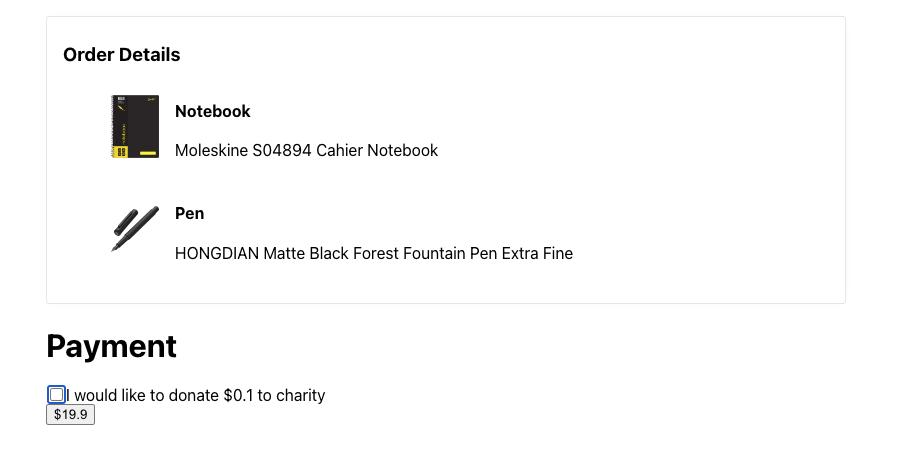

# Donation App

This project was created using Create React App.

In this application we can see how to use different currencies according to each country.
We will be able to use the `Payment` component with the amount of the purchase, the country code, and that will change the donation quantity.

```javascript
<Payment amount={321} countryCode="DK" />
```



## Description

In this small application we can see how to apply good practices in React and Typescript code:

- Extensible code
- Use of hooks
- Use of closures
- Unit and integration tests
